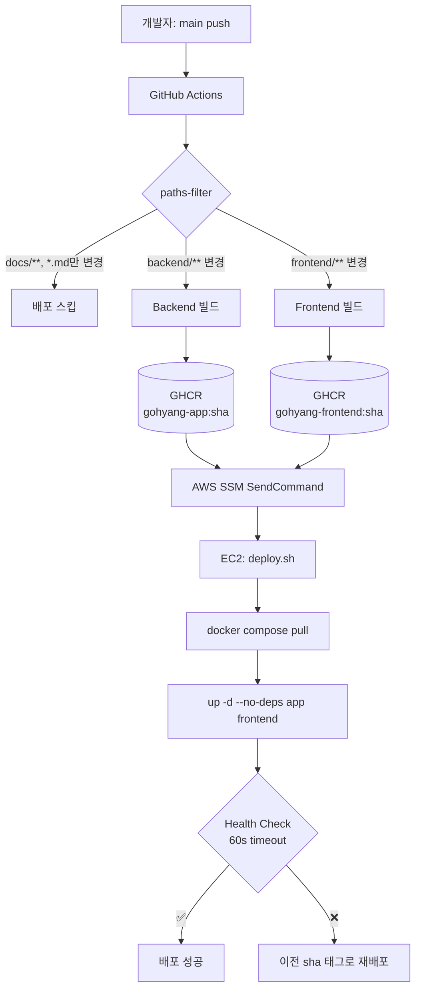
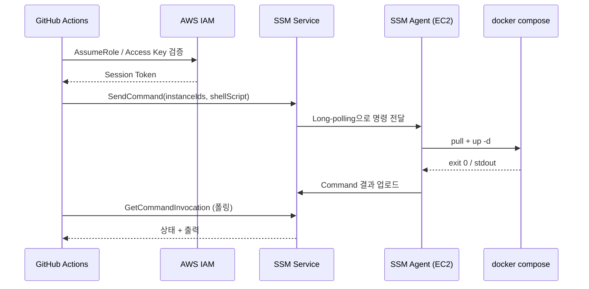
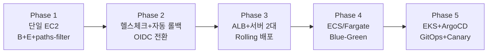

# 37. CD 파이프라인 설계 — SSH 수동 배포에서 GHCR + SSM 자동 배포로

> Week 7 Assetization 스프린트 Step A. "증거로 말하기" 위해서는 "실험을 빨리 돌릴 수 있어야" 한다. CD는 그 출발점.

---

## 1. 배경 — 왜 지금 CD를 설계하는가

지금까지 배포는 이랬다.

```bash
# 로컬 터미널
ssh ghworld
cd ChatAppProject
git pull
docker compose build
docker compose up -d
```

돌아가긴 한다. 문제는 Week 7 스프린트에서 **"부하 테스트 → 병목 발견 → 수정 → 재측정"** 사이클을 여러 번 돌려야 한다는 것.

**수동 SSH 배포의 4가지 아픔**

| # | 문제 | 구체적 손해 |
|---|------|-------|
| 1 | **빌드 리소스 경합** | EC2(t3.medium, 4GB)가 `./gradlew bootJar` + `next build`를 돌리는 동안 서비스 지연 심화. 빌드 중 유저가 들어오면 체감 장애 |
| 2 | **SSH 키 관리 부담** | 키 로테이션 때마다 수동 재배포 스크립트 업데이트. 팀원이 추가되면 배포 권한 공유가 곧 키 공유 |
| 3 | **문서 1줄 바꿔도 풀 배포 유혹** | README 수정도 `ssh + pull`을 "한 김에" 돌리게 됨. 위험한 습관 |
| 4 | **롤백 절차 없음** | 문제 발견 시 `git revert` → `pull` → `build` 5~10분. 그 사이 장애 지속 |

**해결 기준**

- 빌드는 **GitHub Actions Runner**(무료, 충분한 CPU)에서 돌린다
- EC2는 **이미지 pull + 재기동**만 담당한다
- 문서만 바뀌면 **배포를 스킵**한다
- 롤백은 **이전 이미지 sha 태그**로 1초 안에 돌아간다
- SSH 키 대신 **IAM 권한**으로 배포한다

---

## 2. CI vs CD — 개념 정리

혼용되지만 엄밀히 다르다.

| 용어 | 영역 | 목적 |
|------|------|------|
| **CI (Continuous Integration)** | 코드 합치기 | 여러 개발자의 변경이 자주 합쳐지고, 합쳐질 때마다 빌드·테스트가 자동 통과해야 함 |
| **CD (Continuous Delivery)** | 릴리스 가능 상태 유지 | 언제든 **배포 가능한 아티팩트**(이미지·jar 등)를 만들어둠. 실제 배포는 버튼 한 번 |
| **CD (Continuous Deployment)** | 자동 배포 | main 머지 즉시 자동으로 프로덕션까지 나감 |

> Continuous Delivery vs Continuous Deployment는 D가 같은 약자지만 다른 개념이다. 영어권에서는 **"Delivery는 선택적 배포, Deployment는 자동 배포"**로 구분한다.

우리는 Continuous **Deployment**를 목표로 한다. main push → 사람 개입 없이 프로덕션까지. 다만 `workflow_dispatch`로 수동 트리거도 허용해 긴급 롤백·특정 sha 재배포는 버튼으로 가능하게 한다.

---

## 3. 옵션 8개 전수 비교

| # | 옵션 | 빌드 위치 | 배포 채널 | 복잡도 | 이 프로젝트 적합도 |
|---|------|----------|-----------|--------|---------------------|
| A | Actions → SSH → EC2 build | **EC2** | SSH | 낮음 | ❌ 빌드 리소스 경합 |
| **B** | Actions build → GHCR → EC2 pull | **Runner** | SSH/SSM | 중간 | ⭐ 채택 |
| C-1 | AWS CodeDeploy | Runner or S3 | CodeDeploy Agent | 중상 | ❌ 단일 서버에 과함 |
| C-2 | ECS/Fargate | Runner | ECS API | 상 | ❌ stateful 운영 복잡, 예산 초과 |
| D | Watchtower (pull 감지) | Runner | 컨테이너가 스스로 감지 | 낮음 | ❌ CI 연동 없음, 순서 제어 불가 |
| **E** | SSM Run Command (B와 조합) | — | SSM Agent | 중간 | ⭐ 채택 (B와 결합) |
| F | Self-hosted runner on EC2 | **EC2** | 직접 | 중상 | ❌ 서비스 죽음 + 보안 이슈 |
| G | Ansible/Terraform (IaC) | Runner + Runner/로컬 | SSH | 상 | ❌ 서버 1대에 과함 |

### 3.1 Option A — Actions → SSH → EC2에서 git pull + build

**흐름**: Runner가 SSH로 들어가서 `git pull && docker compose build && up -d` 실행.

**장점**: 수동과 멘탈모델 동일. 구현 30분.
**단점**:
- t3.medium이 Spring Boot + Next.js 빌드를 감당하기에 버거움. 빌드 중 Actuator latency 급증
- `Dockerfile` + 소스코드가 모두 EC2에 있어야 함 → 디스크/권한 관리
- 빌드 실패 시 EC2 상태가 어중간하게 남음

### 3.2 Option B — GHCR 이미지 빌드 + EC2에서 pull (채택)

**흐름**:
1. Runner가 `./gradlew bootJar` + `docker build` → `ghcr.io/zkzkzhzj/gohyang-app:<sha>` 푸시
2. EC2는 `docker compose pull && up -d --no-deps app frontend`만 실행

**장점**:
- 빌드 리소스를 Runner로 오프로드 (무료, 고성능)
- sha 태그로 **이미지 = 불변 아티팩트**. 롤백은 태그 교체 1초
- EC2는 "이미지 내려받아 띄우는" 역할만 담당 → 책임 단순

**단점**:
- `docker-compose.yml`을 `build:` 모드에서 `image:` 모드로 전환해야 함
- GHCR 권한·PAT 관리
- GHCR private 이미지면 EC2에 `docker login` 1회 필요

> **왜 GHCR인가.** Docker Hub는 무료 pull 제한(익명 100회/6h)이 있어 재배포 시 rate limit에 걸릴 위험. GHCR은 같은 GitHub 계정이면 private 무제한 + repo 권한 그대로 상속.

### 3.3 Option C-1 — AWS CodeDeploy

**흐름**:
1. Runner가 아티팩트(zip 등)를 S3에 업로드
2. CodeDeploy가 배포 스펙(`appspec.yml`)대로 EC2에 배포
3. Lifecycle hook: `BeforeInstall`, `ApplicationStart`, `ValidateService` 등

**장점**:
- **Blue-Green 배포 표준 지원** (인스턴스 2개 운영 시)
- 실패 시 **자동 롤백** 내장
- AWS 콘솔에서 배포 이력 조회

**단점**:
- `appspec.yml` + lifecycle hook 스크립트를 새로 학습해야 함
- 단일 EC2에선 Blue-Green 자체가 불가능 → 최대 장점 못 누림
- "docker-compose up"을 hook 안에서 돌리려면 결국 쉘 스크립트. Option B와 복잡도 비슷해지는데 AWS 종속만 생김

→ **서버가 2대 이상**이고 **Blue-Green이 필수**인 순간이 오면 재검토할 가치 있음.

### 3.4 Option C-2 — ECS/Fargate

**흐름**: docker-compose → ECS Task Definition 변환. Fargate 쓰면 EC2 관리 불필요.

**장점**:
- 컨테이너 오케스트레이션 (헬스체크·재시작·auto scaling 표준)
- Fargate는 서버리스. OS 패치·SSH 관리 사라짐
- ALB 통합, 배포 중 무중단

**단점 (이 프로젝트 기준 치명적)**:
- **Cassandra/Kafka는 ECS stateful 운영 복잡도 폭등**. EBS 마운트, 노드 identity 관리 등. 실무에서는 RDS/MSK 같은 관리형으로 도망감
- RDS + MSK 전환 시 월 비용 $40 예산 초과 (MSK 단독으로 $50~)
- **"docker-compose 단일 서버"** 서사가 사라짐. 블로그 관점에서 기술 선택의 이야기가 약해짐

→ **유료 전환 의지 + 팀 규모 성장** 시점에 재검토.

### 3.5 Option D — Watchtower (pull 방식)

**흐름**: EC2에 Watchtower 컨테이너를 추가로 돌림. 주기적으로 GHCR을 폴링 → 새 이미지면 pull + restart.

**장점**:
- GitHub Actions가 배포 단계를 안 맡아도 됨 (이미지만 푸시)
- EC2 접근 권한 필요 없음 (pull만)

**단점**:
- **CI 연동 없음** → "배포 완료"를 CI가 모름. 블로그에 쓸 성공/실패 타임라인 증거 없음
- **배포 순서 제어 불가** (app과 frontend 순차 배포 같은 시나리오 X)
- **헬스체크 실패 시 롤백 자동화 어려움**
- 폴링 주기만큼 배포 지연

→ **홈랩·개인 프로젝트**에는 깔끔하지만, **"증거로 말하는" 서비스**에는 부적합.

### 3.6 Option E — AWS SSM Run Command (B와 조합 채택)

**흐름**:
1. EC2에 SSM Agent 활성화 (Ubuntu 24.04 기본 설치)
2. EC2에 IAM Role 부여 (`AmazonSSMManagedInstanceCore`)
3. GitHub Actions가 AWS CLI로 `aws ssm send-command` → EC2에서 지정 쉘 실행
4. 결과는 SSM API로 폴링해서 Actions에 표시

**장점**:
- **SSH 키 관리 제거** → IAM Access Key만 관리
- **포트 22 Security Group에서 제거 가능** → 공격 표면 감소
- SSM Session Manager로 콘솔 접근도 대체 가능 (로컬 디버깅용 `ssh ghworld`도 SSM으로 전환 가능)
- 명령 실행 이력이 CloudTrail에 남음 → 감사 추적

**단점**:
- IAM Role + IAM User 2단 설정이 처음에는 헷갈림
- SSM API 폴링 로직 (배포 완료까지 대기) 작성 필요
- 로컬에서 `ssh` 단축 명령이 익숙하면 전환 비용

### 3.7 Option F — Self-hosted runner on EC2

**흐름**: EC2에 GitHub Actions runner를 설치. 러너가 체크아웃부터 배포까지 전부 한다.

**장점**:
- SSH 없음. 네트워크 경로 단순
- 러너가 이미 프로덕션 환경이라 "빌드 환경과 배포 환경 차이" 문제 없음

**단점**:
- t3.medium은 **빌드를 절대 못 감당함**. 서비스가 죽음
- 러너가 해킹되면 프로덕션 즉시 탈취
- GitHub가 "public repo의 self-hosted runner는 공격 벡터"라고 공식 경고

→ **전용 빌드 서버**가 있을 때만 고려.

### 3.8 Option G — Ansible/Terraform (IaC)

**흐름**: Terraform으로 인프라 프로비저닝 + Ansible playbook으로 배포.

**장점**: 서버가 N대가 되는 순간 필수. 재현 가능한 환경.
**단점**: 서버 1대 + 이미 운영 중인 상태에서는 **"돌아가는 걸 IaC로 역공학"**하는 고통만 큼.

→ **서버 3~5대 구간**에서 진입하는 것이 효율적.

---

## 4. 최종 결정 — B + E + paths-filter

### 4.1 흐름도



### 4.2 조합의 이유

| 요소 | 담당 |
|------|------|
| **B (GHCR)** | 빌드 오프로드 + 이미지 불변성 + 롤백 1초 |
| **E (SSM)** | SSH 키 제거 + IAM 권한 기반 + 포트 22 닫기 |
| **paths-filter** | 문서·AI 에이전트 설정 변경 시 배포 스킵 → 시간·비용 절약 |

블로그 서사:
> "SSH 없는 CI/CD를 AWS SSM으로 어떻게 구축했나"
> "docker-compose 단일 서버에 GHCR 이미지 배포 자동화"
> "paths-filter로 문서 변경 배포 스킵 — 하루 5번씩 돌던 불필요한 배포가 0번으로"

---

## 5. 핵심 개념 5가지

### 5.1 Push vs Pull 배포 모델

| 구분 | Push (Option A/B/E) | Pull (Option D) |
|------|---------------------|-----------------|
| 트리거 | CI에서 "배포해라" 명령 | 서버가 "새 이미지 있나?" 폴링 |
| 배포 타이밍 | main push 즉시 | 폴링 주기마다 |
| 순서 제어 | ✅ | ❌ |
| 헬스체크 후 롤백 | ✅ | ❌ |
| 서버 권한 필요 | ✅ (SSH/SSM) | ❌ |
| 관측 가능성 | Actions 로그에 전 단계 기록 | 서버 로그만 |

**"프로덕션 서비스"는 push, "홈랩"은 pull**로 가는 게 상식이다. 우리는 증거를 만들어야 하니 push.

### 5.2 SSM이 SSH를 대체하는 방식



**핵심**: EC2는 **아웃바운드만 열려** 있으면 된다. SSM Agent가 SSM 서비스에 long-polling 연결을 유지하고, GitHub Actions는 SSM API로 명령을 **"큐에 넣는"** 방식. 인바운드 포트 22/443이 전부 필요 없다.

### 5.3 GHCR 태깅 전략 — `sha` vs `latest`

```yaml
# 안티패턴
tags: ghcr.io/zkzkzhzj/gohyang-app:latest  # 어떤 커밋인지 모름
```

```yaml
# 권장
tags: |
  ghcr.io/zkzkzhzj/gohyang-app:${{ github.sha }}       # 불변 태그
  ghcr.io/zkzkzhzj/gohyang-app:latest                   # 편의용
```

**왜 sha 태그인가**:
- **이미지 = 불변 아티팩트**. 같은 태그에 다른 콘텐츠 들어가면 롤백이 깨짐
- 롤백: `docker compose up -d app@sha:이전해시` 한 줄
- "어떤 코드가 프로덕션에 돌고 있는가"가 GitHub 커밋 한 번에 매칭됨

**latest는 편의용으로만** 두고, 실제 deploy.sh는 항상 sha를 받게 설계.

### 5.4 paths-filter 원리

```yaml
# 방법 1: 워크플로우 자체를 스킵
on:
  push:
    branches: [main]
    paths-ignore:
      - 'docs/**'
      - '**.md'
      - '.claude/**'

# 방법 2: job 단위로 스킵 (세밀)
- uses: dorny/paths-filter@v3
  id: changes
  with:
    filters: |
      backend: ['backend/**']
      frontend: ['frontend/**']

- name: Build backend
  if: steps.changes.outputs.backend == 'true'
  run: ./gradlew bootJar
```

**두 방법을 조합**: 1번으로 문서만 바꾼 커밋은 워크플로우 자체를 안 돌리고, 2번으로 백엔드만 바꾼 경우 프론트 빌드를 스킵한다. 빌드 시간이 절반 이상 줄어들 수 있음.

### 5.5 `--no-deps` 원칙

```bash
# 위험
docker compose up -d

# 안전
docker compose up -d --no-deps app frontend
```

`up -d`는 **변경 감지된 모든 서비스**를 재생성한다. 이 프로젝트는 postgres/redis/cassandra/kafka가 같은 compose에 있어서, 네트워크 설정 하나만 바뀌어도 **DB까지 재기동되는 대참사**가 가능하다.

**`--no-deps`**: 의존성 컨테이너 건드리지 않음.
**`app frontend`** 명시: stateful 서비스는 아예 대상에서 제외.

→ 이것은 **"docker-compose 단일 서버 배포"의 숨은 함정**. docker-compose 공식 문서에도 명시되지 않은 부분이라 한 번 데이고 나면 기억에 남는다.

---

## 6. 배포 전략 비교 — 무중단까지 필요한가

```mermaid
gantt
  title 배포 전략별 다운타임
  dateFormat s
  axisFormat %S초

  section Recreate
  구버전 중지      :r1, 0, 2s
  신버전 기동      :r2, after r1, 3s
  (다운타임 2~5초) :crit, after r1, 3s

  section Rolling
  N1 교체         :rol1, 0, 3s
  N2 교체         :rol2, after rol1, 3s
  (서비스 지속)    :active, 0, 6s

  section Blue-Green
  Green 배포      :bg1, 0, 4s
  트래픽 전환      :bg2, after bg1, 1s
  (순간 전환)      :active, after bg1, 1s

  section Canary
  Canary 10%      :c1, 0, 3s
  검증           :c2, after c1, 5s
  100% 전환       :c3, after c2, 2s
  (점진적)        :active, 0, 10s
```



| 전략 | 다운타임 | 요구 조건 | 이 프로젝트 |
|------|---------|----------|------------|
| **Recreate** | 2~5초 | 단일 인스턴스 | ✅ Phase 1 채택 |
| **Rolling** | 0초 (지속) | 2대 이상 | Phase 4 이후 |
| **Blue-Green** | 0초 (순간) | 2대 + Load Balancer | Phase 4 이후 |
| **Canary** | 0초 (점진) | Traffic splitting 인프라 | Phase 5 이후 |

**Recreate로 시작하는 이유**:
- 단일 EC2에서 2~5초 다운타임은 현실적으로 문제 없음 (유저가 채팅 중 끊기면 WebSocket 재연결)
- 실제 부하 테스트 결과로 "단일 서버 한계"를 증명한 뒤, Rolling으로 갈 **서사**가 생긴다
- Blue-Green을 지금 하려면 서버 2대가 필요한데, 예산 초과

**단, 헬스체크는 꼭 넣는다**:

```bash
for i in {1..30}; do
  curl -sf http://localhost:8080/actuator/health && exit 0
  sleep 2
done
echo "Health check failed"; exit 1
```

실패 시 이전 sha로 자동 롤백하는 스크립트는 Phase 2에서 추가.

---

## 7. 실전 CD 스택 비교

| 스택 | 강점 | 약점 | 우리 선택? |
|------|------|------|----------|
| **GitHub Actions** | 마켓플레이스 풍부, 무료 티어 넉넉, 레포와 일체형 | 2,000분/월 제한 (private repo) | ⭐ 채택 |
| **GitLab CI** | self-hosted 쉬움, 통합된 DevOps 플랫폼 | GitHub repo는 mirror 필요 | ❌ 레포가 GitHub |
| **Jenkins** | 플러그인 생태계, 엔터프라이즈 표준 | 직접 운영 부담, UI 올드스쿨 | ❌ 운영 오버헤드 |
| **ArgoCD** | K8s GitOps 표준, 선언적 | K8s 전제, 우리 환경엔 과함 | ❌ 무용 |
| **Flux** | ArgoCD보다 가벼움 | 역시 K8s 전제 | ❌ |
| **Spinnaker** | Netflix 유래, Canary 전략 내장 | 학습 곡선·운영 복잡 | ❌ |

GitHub Actions + GHCR이 **"이 규모에서 가장 마찰 없는 선택"**이다. 레포가 GitHub에 있으니 인증·권한이 자동, 이미지 레지스트리도 같은 계정이라 PAT 하나로 끝.

---

## 8. 스타트업 vs 대기업 CD 설계 차이

| 관점 | 1~5인 스타트업 (현재 우리) | 대기업 |
|------|------------------------------|--------|
| **트리거** | main push = 즉시 프로덕션 | main merge = staging, 승인 후 prod |
| **환경 수** | prod 1개 | dev / qa / staging / canary / prod |
| **배포 단위** | 전체 서비스 한 번에 | 서비스별 독립 배포 (마이크로서비스) |
| **승인** | 없음 | Change Advisory Board / 자동화된 정책 검사 |
| **롤백** | 이전 sha 태그 수동 | ArgoCD가 자동 관측+롤백 |
| **관측** | Grafana 대시보드 1~2개 | OpenTelemetry 표준, 수십 개 SLO |
| **비용 모델** | 무료 티어 최대 활용 | ROI 기반 예산 배분 |

**우리가 대기업 패턴을 따라가면 안 되는 이유**:
- **학습 기회 상실**: 작은 환경에서 문제를 직접 겪어봐야 "왜 Blue-Green이 필요한가"를 체감한다
- **시간 낭비**: staging 환경 + 승인 파이프라인을 만드는데 1주일. MVP 단계에선 절대 안 됨
- **블로그 소재 고갈**: "이미 다 세팅된" 환경엔 설계 결정 이야기가 없다

**단계적으로 성장하는 것이 자연스러운 설계**:

```text
Phase 1: main push → prod (단일 서버) ← ⭐ 현재 목표
Phase 2: main push → prod + 헬스체크 실패 자동 롤백
Phase 3: main push → staging 자동 + 버튼 승인 → prod
Phase 4: Blue-Green 배포 (서버 2대 + ALB)
Phase 5: Canary 10% → 100% 점진 배포
```

---

## 9. "실험 속도 = 학습 속도" 관점 — DORA Metrics

구글의 **DORA(DevOps Research and Assessment)** 팀이 『Accelerate』(Nicole Forsgren 외)에서 정의한 4가지 지표:

| 지표 | Elite 팀 | Low 팀 |
|------|---------|--------|
| **Deployment Frequency** | 하루 여러 번 | 월 1회 이하 |
| **Lead Time for Changes** | 1시간 이내 | 6개월 이상 |
| **Change Failure Rate** | 0~15% | 46~60% |
| **Mean Time to Restore** | 1시간 이내 | 1주일 이상 |

이 4가지는 **함께 움직인다**.
- 배포가 자주 일어나면 → 변경 단위가 작음 → 실패 시 원인 추적 쉬움 → MTTR 짧음
- 배포가 드물면 → 변경 단위가 큼 → 실패 시 원인 찾기 어려움 → MTTR 길어짐

**우리 프로젝트의 지금**:
- Deployment Frequency: 주 1~2회 (수동)
- Lead Time: 30분~1시간 (빌드+배포)
- Change Failure Rate: 측정 안 함
- MTTR: 측정 안 함

**CD 구축 후 목표**:
- Deployment Frequency: 하루 3~5회 (부하 테스트 사이클 중)
- Lead Time: 10분 이내
- Change Failure Rate: CI 테스트로 대부분 걸러짐. 5% 이하 목표
- MTTR: sha 태그 롤백으로 1분

**이것이 곧 블로그 Task 1의 Before/After 증거가 된다.**

> 『Accelerate』(2018), Nicole Forsgren, Jez Humble, Gene Kim — "IT 성과의 과학적 측정"을 개척한 책. SRE Book과 함께 필독.

---

## 10. 실전 주의사항 5가지

### 10.1 GHCR 권한 — PAT vs GITHUB_TOKEN

- **GitHub Actions 안에서 push**: `GITHUB_TOKEN`으로 충분 (자동 발급, repo 권한 상속)
- **EC2에서 pull (private 이미지)**: 별도 PAT 필요. `read:packages` 권한만 있으면 됨

GHCR을 처음 쓰면 패키지 페이지에서 **"Package settings → Manage Actions access → Add Repository"**를 꼭 해야 한다. 안 하면 `denied: permission_denied` 에러.

### 10.2 이미지 사이즈 최적화

```dockerfile
# 안티패턴 (1.2GB)
FROM openjdk:21
COPY build/libs/*.jar app.jar
CMD ["java", "-jar", "app.jar"]

# 권장 (300MB 이하)
FROM eclipse-temurin:21-jre-alpine
COPY build/libs/*.jar app.jar
CMD ["java", "-jar", "app.jar"]

# 더 권장: Multi-stage
FROM gradle:8-jdk21 AS builder
WORKDIR /app
COPY . .
RUN ./gradlew bootJar

FROM eclipse-temurin:21-jre-alpine
COPY --from=builder /app/build/libs/*.jar app.jar
CMD ["java", "-jar", "app.jar"]
```

**왜 중요한가**: 이미지 1GB면 GHCR push + EC2 pull에 각각 30초~1분. 300MB면 각 10초. **배포 시간이 5분 → 1분으로 줄어듦.**

### 10.3 IAM 최소 권한 원칙

GitHub Actions용 IAM User 권한은 **딱 필요한 것만**:

```json
{
  "Version": "2012-10-17",
  "Statement": [
    {
      "Effect": "Allow",
      "Action": [
        "ssm:SendCommand",
        "ssm:GetCommandInvocation"
      ],
      "Resource": [
        "arn:aws:ec2:ap-northeast-2:<account>:instance/i-<instance-id>",
        "arn:aws:ssm:ap-northeast-2:*:document/AWS-RunShellScript"
      ]
    }
  ]
}
```

`"*"` 권한은 **절대 금지**. 키 유출 시 AWS 계정 전체가 털린다.

### 10.4 OIDC 전환 (향후 고도화)

Access Key 대신 **OIDC 토큰**으로 GitHub Actions ↔ AWS 신뢰 관계를 맺을 수 있다.

```yaml
- uses: aws-actions/configure-aws-credentials@v4
  with:
    role-to-assume: arn:aws:iam::<account>:role/GitHubActionsRole
    aws-region: ap-northeast-2
# Access Key 없음!
```

**장점**: 장기 시크릿 제거. 키 로테이션 불필요. 보안 감사 친화적.
**단점**: IAM Identity Provider + Role Trust Policy 설정 복잡.

→ **처음엔 Access Key로 시작하고**, 익숙해지면 OIDC로 전환. 블로그 2부 소재로 좋음.

### 10.5 헬스체크 설계 — Actuator `/health`의 함정

```yaml
# application.yml — 기본 설정
management:
  endpoints:
    web:
      exposure:
        include: health
```

기본 `/actuator/health`는 **DB/Redis/Kafka가 모두 UP이어야 200**을 반환한다. 배포 직후 DB 재연결 중이면 `DOWN` 나와서 롤백 발동.

**권장**:

```yaml
management:
  endpoint:
    health:
      probes:
        enabled: true
      group:
        liveness:
          include: livenessState
        readiness:
          include: readinessState, db, redis
```

- `/actuator/health/liveness`: 앱이 살아있는가? (프로세스 생존)
- `/actuator/health/readiness`: 트래픽 받을 준비가 됐는가?

배포 헬스체크는 **readiness**를 확인해야 한다.

---

## 11. 이 선택이 틀렸다고 느낄 시점

언젠가 B+E 조합으로는 안 될 때가 온다. 그때가 되면 다음으로 간다.

| 신호 | 다음 옵션 |
|------|----------|
| 서버 2대 이상 구성 | **Rolling 배포** (compose 단독으론 어려움) |
| WebSocket 세션 유지가 필요한 무중단 배포 | **Blue-Green + ALB sticky session** |
| 팀이 3명 이상 → 배포 충돌 | **staging 환경 + 승인 게이트** |
| 마이크로서비스화 | **서비스별 독립 파이프라인** (ArgoCD/ECS) |
| 월 배포 100회 초과 | **Canary 자동화 + 메트릭 기반 자동 롤백** |
| 규제 산업 (금융/의료) 진입 | **SOC2 감사 대응 → CodeDeploy 이력 활용** |

**지금 당장 이 모든 걸 준비하지 않는 것**이 핵심이다. 필요해진 시점에 필요한 만큼만 올린다.

---

## 12. Phase별 확장 경로



각 Phase마다 트리거 조건이 분명하다:
- P1 → P2: 부하 테스트 중 배포 실패 1회 경험
- P2 → P3: 동시 접속자 200명 지속 + 단일 서버 CPU 80% 도달
- P3 → P4: 서버 5대 이상 + docker-compose 관리 한계
- P4 → P5: 팀 5명 이상 + 마이크로서비스 5개 이상

**지금 P1을 잘 만들어야** 나중에 교체가 쉽다. 이미지·헬스체크·롤백 같은 **인터페이스**를 견고히 만들면 그 아래 인프라는 얼마든 바뀔 수 있다.

---

## 13. 더 공부할 거리

### 공식 문서

- [GitHub Actions — Deploying with AWS (OIDC 포함)](https://docs.github.com/en/actions/deployment/security-hardening-your-deployments/configuring-openid-connect-in-amazon-web-services)
- [AWS SSM Run Command](https://docs.aws.amazon.com/systems-manager/latest/userguide/execute-remote-commands.html)
- [GHCR — Working with the Container registry](https://docs.github.com/en/packages/working-with-a-github-packages-registry/working-with-the-container-registry)
- [Docker Compose — the --no-deps option](https://docs.docker.com/reference/cli/docker/compose/up/)
- [Spring Boot Actuator — Kubernetes Probes](https://docs.spring.io/spring-boot/reference/actuator/endpoints.html#actuator.endpoints.kubernetes-probes)

### 도서

- 『Accelerate』 (Nicole Forsgren, Jez Humble, Gene Kim, 2018) — DORA Metrics의 근거
- 『Site Reliability Engineering』 (Google, 2016) — SRE 교과서. 무료 공개
- 『The DevOps Handbook』 (Gene Kim 외, 2016) — CI/CD 문화적 기반
- 『Continuous Delivery』 (Jez Humble, David Farley, 2010) — CD 원전

### 벤치마크

- [DORA State of DevOps Report (연간 발간)](https://dora.dev/research/)
- [Google Cloud — Four Keys](https://cloud.google.com/blog/products/devops-sre/using-the-four-keys-to-measure-your-devops-performance)

### 블로그·강연

- [Dan North — Continuous Delivery vs Continuous Deployment](https://dannorth.net/)
- [Martin Fowler — Blue Green Deployment](https://martinfowler.com/bliki/BlueGreenDeployment.html)
- [Martin Fowler — Canary Release](https://martinfowler.com/bliki/CanaryRelease.html)

---

## 요약 (한 줄)

**"증거로 말하려면 실험을 빨리 돌려야 하고, 실험을 빨리 돌리려면 배포가 자동화돼야 한다."**

GHCR + SSM + paths-filter 조합은 **"단일 서버 docker-compose 환경"에서 가장 마찰 없는 CD**다. 블로그 서사도 확보되고, 예산 초과도 없고, 향후 ECS/K8s로 갈 때 이미지와 헬스체크 인터페이스가 그대로 재사용된다.

이보다 단순한 길(A, D)은 위험하고, 이보다 복잡한 길(C, F, G)은 과하다. 지금은 B+E가 **"딱 필요한 만큼"**이다.

---

## 14. 실제 구현 — 설계에서 코드로

설계를 코드로 옮기는 과정에서 발견된 실전 디테일과 결정들을 기록한다.

### 14.1 OIDC 전환 (Access Key → Role Assume)

초기 설계는 `AWS_ACCESS_KEY_ID` + `AWS_SECRET_ACCESS_KEY`를 GitHub Secrets에 두는 방식이었는데, AWS 콘솔이 "IAM Roles Anywhere 권장" 배너를 띄우는 걸 보고 **GitHub Actions 전용 OIDC 연합**으로 전환했다.

**IAM Roles Anywhere는 이 프로젝트의 답이 아니었다.** Roles Anywhere는 온프레미스·다른 클라우드용 서비스이고, GitHub Actions는 이미 자체 OIDC Provider를 내장하고 있어 AWS와 직접 연합이 가능하다.

**최종 Trust Policy**:
```json
{
  "Version": "2012-10-17",
  "Statement": [
    {
      "Effect": "Allow",
      "Action": "sts:AssumeRoleWithWebIdentity",
      "Principal": {
        "Federated": "arn:aws:iam::<account>:oidc-provider/token.actions.githubusercontent.com"
      },
      "Condition": {
        "StringEquals": {
          "token.actions.githubusercontent.com:aud": "sts.amazonaws.com",
          "token.actions.githubusercontent.com:sub": "repo:zkzkzhzj/ChatAppProject:ref:refs/heads/main"
        }
      }
    }
  ]
}
```

**얻은 것**:
- 장기 시크릿(Access Key) 완전 제거
- 유출 시 피해 반경 = 토큰 만료 시간(1시간)
- `sub` 조건으로 **"main 브랜치에서 온 워크플로우만"** 허용 → fork·피처 브랜치 방어

**실수했던 점**:
- AWS UI가 자동 생성한 Trust Policy에 sub 값이 **중복**돼 있었음 — 한 번 정리 필요했음
- `StringLike`를 `StringEquals`로 바꿔 더 엄격하게 설정

### 14.2 GHCR PAT — Fine-grained vs Classic

**실전 결과**: Fine-grained PAT이 "최신·권장"인데도 **GHCR container image pull은 Classic PAT이 필요**하다. GitHub 공식 문서에 명시돼 있지만 콘솔 UI만 보면 모르는 함정.

| 용도 | 권장 토큰 |
|------|----------|
| 일반 REST API·레포 접근 | Fine-grained |
| GHCR container pull/push | **Classic** (`read:packages` / `write:packages`) |
| npm·RubyGems·Maven | Fine-grained 가능 |

원칙: **서비스마다 필요한 토큰 타입을 공식 문서에서 확인**. AWS·GitHub UI의 "권장" 배너를 맹신하면 40분 삽질.

### 14.3 `docker-compose.yml` 이미지 모드 전환

**고민**: `build:`를 없애고 `image:`만 둘까? 아니면 둘 다 둘까?

**결정**: **둘 다 유지**. 이유:
- 로컬 개발: `docker compose build`로 즉시 빌드 → 반복 실험 용이
- 프로덕션(CD): `docker compose pull` → GHCR 이미지 사용
- `image:` 태그 이름이 build 시 output 태그로도 쓰여서 **로컬 빌드 결과를 GHCR에 수동 push도 가능**

```yaml
app:
  image: ghcr.io/zkzkzhzj/gohyang-app:${APP_TAG:-latest}  # pull 시 사용
  build:                                                   # build 시 사용 (로컬)
    context: ./backend
    dockerfile: Dockerfile
```

### 14.4 `deploy.sh`의 롤백 로직

```bash
# 핵심 부분
PREV_APP_TAG=$(docker inspect --format='{{.Config.Image}}' gohyang-app | awk -F: '{print $NF}')
...
# 헬스체크 실패 시
export APP_TAG=$PREV_APP_TAG
docker compose up -d --no-deps --no-build app frontend
```

**왜 이 방식인가**:
- 컨테이너가 현재 실행 중인 **이미지 태그 자체가 "최후의 성공 상태"**
- 별도 메타데이터 저장 없이 Docker inspect로 복구 지점 확보
- 단, `docker compose up` 이후 inspect하면 이미 새 태그라 너무 늦음 → **pull 전에 기록**해야 함

**한계**:
- 컨테이너가 아예 없으면 (첫 배포) `PREV_APP_TAG`가 `latest`로 fallback
- 스키마 마이그레이션이 포함된 배포는 롤백해도 DB 상태는 원복 안 됨 → **마이그레이션은 backward-compatible하게** 작성하는 게 전제

### 14.5 paths-filter의 실제 정의

```yaml
filters: |
  backend:
    - 'backend/**'
    - 'docker-compose.yml'
    - 'scripts/deploy.sh'
    - '.github/workflows/deploy.yml'
  frontend:
    - 'frontend/**'
    - 'docker-compose.yml'
    - '.github/workflows/deploy.yml'
```

**주의 포인트**:
- `docker-compose.yml`은 **양쪽에 모두** 포함 — compose 변경 시 두 이미지가 모두 재빌드돼야 할 수 있음
- `deploy.yml` 자체를 수정했을 때도 재빌드 트리거 — 워크플로우 디버깅 시 유용

**무시 대상** (`paths-ignore`):
- `docs/**`, `**.md` — 문서만 바뀐 커밋은 배포 스킵
- `.claude/**` — AI 에이전트 설정 변경은 배포 불필요
- `llm-test/**` — LLM 실험용 스크립트

### 14.6 조건부 배포 매트릭스

```yaml
deploy:
  needs: [detect-changes, build-backend, build-frontend]
  if: |
    always() &&
    (needs.build-backend.result == 'success' || needs.build-backend.result == 'skipped') &&
    (needs.build-frontend.result == 'success' || needs.build-frontend.result == 'skipped') &&
    (needs.detect-changes.outputs.backend == 'true' || needs.detect-changes.outputs.frontend == 'true' || inputs.force_rebuild)
```

**`always()`의 역할**: 상위 job이 `skipped`여도 하위가 평가되도록. 기본 조건은 `success`만 통과시키므로 조건부 빌드에선 필수.

**`force_rebuild` input**: 초기 배포 또는 이미지 재생성이 필요할 때 수동 트리거 — `workflow_dispatch`의 boolean 입력으로 노출.

### 14.7 SSM 실행 방식 — 스크립트 inline vs 파일 호출

**파일 호출** (채택):
```bash
PARAMS=$(jq -n --arg sha "$COMMIT_SHA" --arg app "$APP_TAG" --arg front "$FRONTEND_TAG" \
  '{commands: ["sudo -u ubuntu bash /home/ubuntu/ChatAppProject/scripts/deploy.sh \"\($sha)\" \"\($app)\" \"\($front)\""]}')

aws ssm send-command --parameters "$PARAMS" ...
```

**파일 호출을 택한 이유**:
- 배포 로직이 **버전 관리**됨 (레포의 `scripts/deploy.sh`)
- workflow YAML이 짧고 가독성 높음
- 로컬에서 직접 실행 가능 (디버깅 용이)
- **자기 업데이트**: `git reset --hard <SHA>` 이 스크립트 안에서 수행되므로 매 배포마다 스크립트도 최신화

**`jq -n`으로 JSON 안전 조립**: 인자를 쉘 문자열 concatenation으로 넘기면 공백·따옴표·특수문자로 인젝션 여지가 있다. `jq`의 `--arg`는 값을 JSON 문자열로 정식 이스케이프해서 안전하게 조립한다. SHA·태그는 hex라 사실상 안전하지만 방어적 코딩 원칙.

**선행 조건**: 첫 배포 전 EC2에 `scripts/deploy.sh`가 존재해야 함 → Phase 3 Step 3에서 `git pull` + `chmod +x` 수동 실행 필요.

### 14.7.1 레이스 컨디션 방지 — COMMIT_SHA 인자

초기 구현은 `git reset --hard origin/main`이었는데, Codex 리뷰에서 다음 시나리오가 제기됨:

```text
T=0 : PR #15 머지 → main = SHA_A
T=0+1s : CD 시작, app:SHA_A 이미지 빌드 중
T=0+30s : 다른 PR #16 머지 → main = SHA_B
T=0+60s : #15의 CD가 EC2에 SSM 명령 전송
         → EC2에서 git reset --hard origin/main 실행
         → 실제로 체크아웃되는 건 SHA_B (docker-compose.yml은 신버전)
         → 그런데 pull하는 이미지는 app:SHA_A (구버전)
         → 비결정적 실패
```

**수정**: 워크플로우가 triggering SHA(`$GITHUB_SHA`)를 deploy.sh에 전달하고, 스크립트는 정확히 그 SHA로 `git reset`.

```bash
# deploy.sh
COMMIT_SHA="$1"
git fetch origin "$COMMIT_SHA"
git reset --hard "$COMMIT_SHA"
```

**배운 점**: "최신 브랜치 헤드"는 배포의 기준 시점으로 적합하지 않다. 배포는 **특정 커밋에 대한 불변 연산**이어야 한다.

### 14.7.2 skipped 빌드 태그 처리 — latest fallback 금지

초기 구현은 "빌드가 스킵되면 `latest` 태그로 fallback"이었는데, Codex 리뷰가 비결정성 지적:

```text
시나리오:
1. backend 배포 실패 → latest 태그가 bad 이미지 가리킴
2. 며칠 뒤 frontend-only 커밋 머지
3. CD 트리거 → backend 빌드 스킵 → APP_TAG=latest
4. EC2에서 docker compose pull → bad backend 이미지 내려받음
5. 재기동 → 헬스체크 실패 → 롤백 발동 (혼란스러운 장애)
```

**수정**: 스킵된 컴포넌트는 빈 문자열로 시그널, deploy.sh가 **현재 실행 중인 컨테이너의 태그**를 그대로 유지.

```bash
# workflow
if [ "${{ needs.build-backend.result }}" = "success" ]; then
  echo "app_tag=${{ github.sha }}" >> "$GITHUB_OUTPUT"
else
  echo "app_tag=" >> "$GITHUB_OUTPUT"   # 스킵 시그널
fi

# deploy.sh
PREV_APP_TAG=$(docker inspect --format='{{.Config.Image}}' gohyang-app | awk -F: '{print $NF}')
APP_TAG="${APP_TAG_INPUT:-$PREV_APP_TAG}"
```

**배운 점**: `latest` 태그는 **"지금 무엇이 가리키는지 모호"**한 움직이는 타겟이다. 결정적 배포에서는 sha 고정이 원칙.

### 14.7.3 2차 리뷰 — 동시 배포·타임아웃·untracked 파일

2차 CodeRabbit 리뷰에서 운영 안전성 관련 3가지가 추가로 지적됨.

**① 동시 배포 직렬화 (Critical)**

```yaml
# .github/workflows/deploy.yml
concurrency:
  group: prod-deploy
  cancel-in-progress: false
```

`main`에 연속 푸시가 들어오면 두 워크플로우가 병렬로 돌며 **같은 EC2에서 두 `deploy.sh`가 서로의 `git reset`·`docker compose up`·롤백을 덮어쓰는** 레이스가 가능. GitHub Actions의 `concurrency`로 동일 그룹 내 직렬화. **`cancel-in-progress: false`**가 중요 — 진행 중 배포를 취소하면 중간 상태로 서비스가 멈출 수 있다.

**② 헬스체크 curl 타임아웃**

```bash
curl --connect-timeout 1 --max-time 2 -sf ...
```

기본 curl은 타임아웃이 없어 **컨테이너가 응답 없이 매달리면** 한 번의 `check_health`가 수분 걸릴 수 있음 → `MAX_RETRIES * SLEEP_SEC` 예산(90초)이 무력화. 개별 요청에 짧은 타임아웃을 두어 실패를 빠르게 감지.

**③ `git reset` 후 `git clean -fd`**

```bash
git reset --hard "$COMMIT_SHA"
git clean -fd
```

`git reset --hard`는 **tracked 파일만** 되돌린다. EC2에 남은 untracked 파일(예: 디버깅 중 만든 `docker-compose.override.yml`)은 그대로 살아남아 다음 배포를 오염시킴. `git clean -fd`로 완전히 결정적 상태 확보.

**배운 점 종합**:
- "빠른 실패"와 "예산 준수"를 위해 **모든 네트워크 호출에 타임아웃**
- "결정적 상태"는 reset만으로 부족. **clean까지 포함해야 완전체**
- 병렬 실행이 가능한 CI 환경에서 **명시적 직렬화**는 옵션이 아니라 필수

### 14.7.4 3차 자체 audit — 롤백 경로 안전성

리뷰가 못 잡은 걸 선제적으로 잡으려고 한 번 더 훑어봤다. 세 가지 버그 발견.

**① `docker inspect | awk || echo latest` 패턴의 함정**

```bash
# 틀린 패턴 (초기 구현)
PREV_APP_TAG=$(docker inspect ... 2>/dev/null | awk -F: '{print $NF}' || echo "latest")
```

의도: "inspect 실패 시 latest 사용".
실제: inspect가 실패해도 **파이프 뒤의 awk가 성공 처리**. awk는 빈 입력에서 exit 0, 빈 출력. `||` 트리거 안 됨. **첫 배포/컨테이너 삭제 상황에서 PREV가 빈 문자열**.

```bash
# 고친 패턴
get_current_tag() {
  local container="$1" image
  image=$(docker inspect --format='{{.Config.Image}}' "$container" 2>/dev/null || true)
  if [ -z "$image" ]; then
    echo "latest"
  else
    echo "${image##*:}"
  fi
}
```

파이프 체인으로 exit code를 추적하려면 **`set -o pipefail`**만으로 부족하고, 명시적 검증이 필요할 때가 있다.

**② compose up 자체 실패 시 롤백 미수행**

초기 구현은 헬스체크 실패에만 롤백. `docker compose up`이 이미지 이슈·port conflict·cgroup 오류로 **즉시 실패**하면 `set -e`가 스크립트를 바로 종료 → 롤백 기회 없음 → "새 컨테이너 없음 + 구 컨테이너 stop됨" 반쪽 상태.

```bash
# 고친 구조
if ! docker compose up -d --no-deps --no-build app frontend; then
  log "❌ docker compose up 실패. 롤백 수행."
  rollback
  exit 1
fi
```

**③ 롤백 `compose up`도 `set -e`에 당하면 로그 유실**

롤백 시도 자체가 실패하면 "수동 개입 필요" 로그를 찍을 기회도 없이 스크립트가 죽는다. 롤백 함수로 분리하고 각 단계마다 exit code 체크:

```bash
rollback() {
  if ! docker compose up -d --no-deps --no-build app frontend; then
    log "⚠ 롤백 compose up 자체 실패. 수동 개입 필요."
    return 1
  fi
  ...
}
```

**배운 점**:
- **파이프 체인의 exit 전파**는 직관과 다르다. 끝 단계의 성공이 앞 단계 실패를 가린다
- **`set -e`는 "기본 실패 처리"지만 분기가 필요한 지점은 명시적 `if !`로 랩핑**해야 함
- **롤백 경로 자체가 실패할 가능성**을 항상 염두에 두고 로그 visibility를 보존할 것

### 14.8 배포 완료 폴링 패턴

SSM SendCommand는 비동기다. GitHub Actions는 polling으로 완료를 기다려야 함.

```bash
for i in $(seq 1 60); do
  STATUS=$(aws ssm get-command-invocation ...)
  case "$STATUS" in
    Success)   echo "ok"; exit 0 ;;
    Failed|Cancelled|TimedOut) exit 1 ;;
  esac
  sleep 10
done
```

**지연 기준**:
- 10초 × 60회 = 최대 **10분 타임아웃**
- Spring Boot 부팅·Cassandra/Kafka healthy 대기까지 감안
- t3.medium 4GB에서 재기동 소요 실측: **app 40~60초, frontend 15~25초**

### 14.9 로컬 dev 환경 영향

이번 변경으로 로컬 개발에도 미묘한 영향이 있다:
- `docker compose build`를 명시하지 않으면 **compose가 `ghcr.io/...:latest`를 pull 시도** → 401 (로그인 안 돼있을 때)
- 해결: 로컬은 항상 `docker compose up --build`로 명시적 빌드
- 또는 `APP_TAG=dev-local`로 설정해서 pull이 실패하면 바로 build로 fallback

### 14.10 남은 작업

Phase 3 실전 테스트에서 검증할 항목:

- [ ] 첫 `workflow_dispatch` (force_rebuild=true) 성공
- [ ] 자동 트리거 (main push) 성공
- [ ] backend만 변경한 커밋 → frontend 빌드 스킵 확인
- [ ] docs/\*.md만 변경한 커밋 → 전체 배포 스킵 확인
- [ ] 헬스체크 고의 실패 → 자동 롤백 동작 확인
- [ ] 포트 22 Security Group에서 제거 → SSM Session Manager만으로 관리 가능 확인

완료되면 section 14.11에 실측 데이터(빌드 시간, 배포 시간, DORA Metrics 전후)를 추가한다.

---

## 15. 이 문서의 성장 계획

이 학습노트는 **Phase 3 검증 → Phase 4 개선 → 블로그 글** 순으로 성장한다.

| 단계 | 추가할 내용 |
|------|-----------|
| Phase 3 완료 후 | 실측 빌드 시간·배포 시간·롤백 테스트 결과 |
| 부하 테스트 후 | 병목 식별, 왜 단일 서버가 한계인지 (블로그 Task 1 근거) |
| 스케일아웃 후 | Blue-Green 도입 경위, Before/After DORA Metrics |
| OIDC 전환 회고 | Access Key 운용 대비 실질 이득·감사 로그 변화 |

**"살아있는 문서"**로 유지한다. 코드가 바뀌면 이 문서도 바뀐다.
