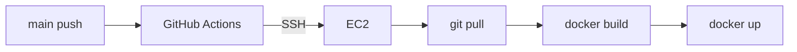
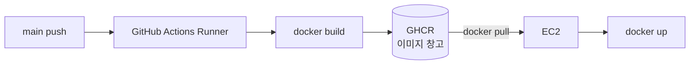
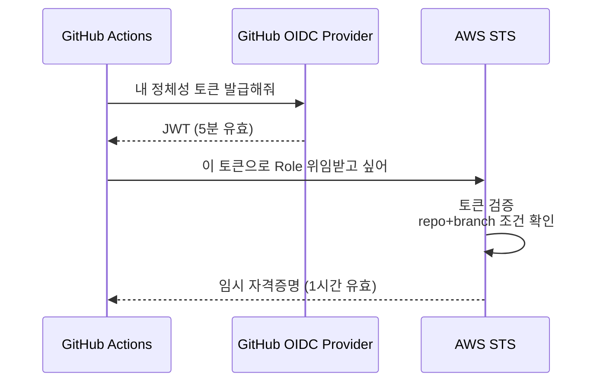
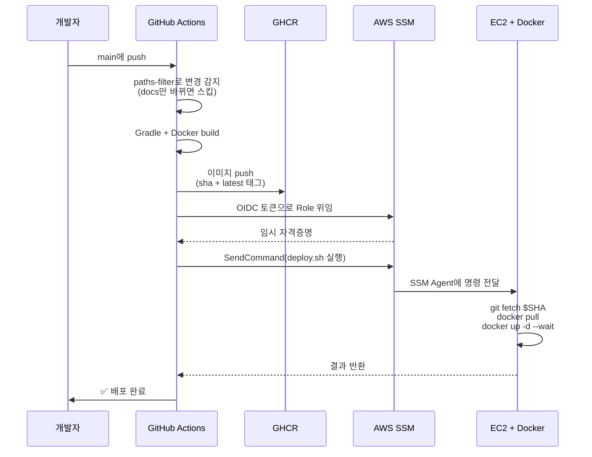
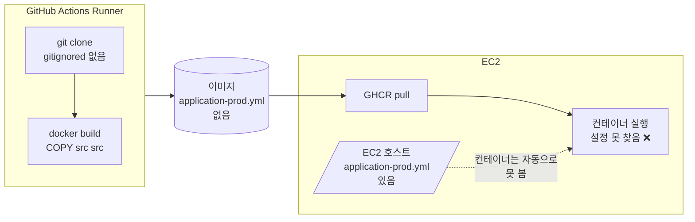

# 37. CD 파이프라인 구축기 — 수동 SSH에서 GHCR + SSM + OIDC로

> Week 7 Assetization 스프린트의 첫 번째 작업. 부하 테스트 사이클을 빨리 돌리려면 "배포 자동화"가 먼저 필요했다. 이 글은 설계 문서가 아니라 **"왜 이 선택을 했고 구현하며 뭘 배웠는지"의 여정**이다.

---

## 1. 왜 시작했나 — 수동 배포의 아픔

CD 전까지 배포는 이랬다.

```bash
# 로컬 터미널
ssh ghworld
cd ChatAppProject
git pull
docker compose build
docker compose up -d
```

돌아가긴 한다. 근데 **부하 테스트**를 시작하려니 문제가 보였다.

- 병목 발견 → 수정 → **다시 배포** 사이클을 수십 번 돌아야 함
- 위 6개 명령을 매번 치려니 피곤
- EC2(t3.medium, 4GB)가 빌드까지 하면 빌드 중 서비스 느려짐 → 부하 테스트 값이 왜곡됨
- 문서 1줄 고쳐도 "한 김에" 다 올리고 싶은 유혹 → 위험한 습관
- 롤백 절차가 없음. 문제 터지면 `git revert` → 재빌드 5~10분 대기

**한 마디로 "실험 속도"가 나오지 않는다.** 그래서 CD부터 손봤다.

---

## 2. CD란 뭔가 — CI와 어떻게 다른가

혼용되지만 다르다.

| 용어 | 뭘 하나 |
|------|--------|
| **CI** (Continuous Integration) | 코드 합칠 때마다 자동으로 빌드·테스트 |
| **CD** (Continuous Deployment) | **main에 머지되면 프로덕션까지 자동 배포** |

이 프로젝트는 이미 GitHub Actions로 CI(`ci.yml`)가 돌고 있었다. 이번 작업은 **CD 추가**.

---

## 3. 두 가지 접근 — 어디서 빌드할 것인가

핵심 결정 포인트는 "**이미지를 어디에서 만들 것인가**"다.

### 접근 A. "EC2에 SSH 접속해서 거기서 빌드"



**장점**: 이해하기 쉬움. 지금 수동으로 하는 것과 동일.
**단점**:
- EC2가 빌드하는 동안 서비스 느려짐
- 4GB에서 Spring Boot + Next.js 빌드가 빠듯함

### 접근 B. "외부에서 이미지 만들어 레지스트리에 푸시 → EC2는 pull만"



**장점**:
- 빌드 부하를 Runner(GitHub 무료 VM)로 오프로드 → EC2 서비스 건드리지 않음
- 이미지에 sha 태그를 박아두면 **롤백이 1초**
- 여러 서버에 배포할 때 같은 이미지 재사용

**단점**:
- 구조가 복잡해짐
- **빌드 환경(Runner)과 실행 환경(EC2)이 분리됨** → 이게 나중에 뒷통수를 때린다

### 우리 선택: 접근 B

t3.medium이 부하 테스트 중 빌드까지 감당할 수 없다는 게 결정적이었다.

---

## 4. 조합한 도구들 — GHCR + SSM + OIDC

접근 B로 가는데 **세 가지 부품**이 필요하다.

### 4.1 GHCR (GitHub Container Registry)

"**이미지 보관 창고**". GitHub이 운영하는 Docker 이미지 저장소.

```
Runner에서 build
  ↓ docker push
ghcr.io/zkzkzhzj/gohyang-app:<sha>
  ↓ docker pull
EC2
```

Docker Hub(`hub.docker.com`)와 같은 역할. 우리 레포와 같은 계정에서 무료·무제한이라 선택.

### 4.2 AWS SSM (Systems Manager)

"**SSH를 대체하는 원격 실행 API**". AWS가 제공.

- EC2에 SSM Agent가 떠있음 (Ubuntu 24.04 기본 설치됨)
- AWS API로 "이 명령 실행해라"를 보내면 Agent가 받아서 실행
- **SSH 키 관리 불필요**, IAM 권한으로 제어
- **포트 22를 열어둘 필요 없음** (Agent가 아웃바운드로 연결)

```
GitHub Actions
  ↓ aws ssm send-command
SSM 서비스
  ↓ (EC2 Agent가 long-polling으로 명령 수신)
EC2에서 deploy.sh 실행
```

### 4.3 OIDC Federation

"**AWS Access Key 없이 임시 토큰만으로 AWS 쓰기**".

처음엔 GitHub Secrets에 `AWS_ACCESS_KEY_ID` + `AWS_SECRET_ACCESS_KEY`를 넣으려 했다. 근데 AWS 콘솔이 "IAM Roles Anywhere가 더 좋다"며 권장 배너를 띄웠다.

**사실 GitHub Actions에는 더 나은 방법이 있다 — OIDC.**



**장점**:
- 장기 시크릿(Access Key)이 아예 **존재하지 않음**
- 유출되어도 1시간 뒤 만료
- `sub` 조건으로 **"main 브랜치에서 돌아간 워크플로우만"** 허용 가능

Trust Policy (핵심 부분):
```json
"Condition": {
  "StringEquals": {
    "token.actions.githubusercontent.com:sub": "repo:zkzkzhzj/ChatAppProject:ref:refs/heads/main"
  }
}
```

**GitHub Actions는 자체 OIDC Provider가 내장**되어 있어서, AWS와 직접 연합이 가능하다. Roles Anywhere는 온프레미스·다른 클라우드용. 우리 케이스는 OIDC가 정답.

---

## 5. 전체 흐름



---

## 6. 실전에서 배운 것 — 실패 기록

설계는 깔끔했는데 **현실이 계속 때렸다**. 실패를 정리한다.

### 6.1 paths-filter로 불필요한 배포 줄이기

처음엔 `main push`면 무조건 CD가 돌았다. 근데 `README.md` 1줄만 고친 커밋에도 빌드 5분 + 배포 3분이 돌면 시간 낭비.

`dorny/paths-filter` 액션으로 **변경된 영역만 빌드**:

```yaml
filters: |
  backend: ['backend/**']
  frontend: ['frontend/**']
```

거기에 워크플로우 자체에 `paths-ignore`:

```yaml
paths-ignore:
  - 'docs/**'
  - '**.md'
  - '.claude/**'
```

docs만 바뀌면 **CD 자체가 안 돈다**. 하루 여러 번 문서만 다듬는 날에 큰 차이.

### 6.2 `latest` 태그는 롤백에 독이 된다 (Codex 1차 리뷰)

처음에 빌드가 스킵된 컴포넌트는 `latest` 태그로 fallback 시켰다.

```yaml
if [ "$backend_result" != "success" ]; then
  APP_TAG="latest"   # ← 이게 문제
fi
```

**왜 문제인가**:

```
시나리오:
1. backend 배포 실패 → latest 태그가 bad 이미지 가리킴
2. 며칠 뒤 frontend-only 커밋 머지
3. CD 트리거 → backend 빌드 스킵 → APP_TAG=latest
4. EC2가 pull하는 게 며칠 전의 bad 이미지
5. 또 실패 → 혼란
```

**수정**: skipped는 빈 문자열로 넘기고, `deploy.sh`가 **현재 실행 중 컨테이너의 태그**를 유지.

```bash
# deploy.sh
APP_TAG="${APP_TAG_INPUT:-$PREV_APP_TAG}"
```

배운 점: **`latest`는 "지금 뭘 가리키는지 모호"한 타겟**. 결정적 배포에선 sha 고정이 원칙.

### 6.3 `git reset origin/main`의 레이스 (Codex 1차 리뷰)

초기 deploy.sh는 `git reset --hard origin/main`이었다. 문제:

```
T=0:   PR A 머지 → main = SHA_A → CD 시작, app:SHA_A 빌드 중
T=30:  PR B 머지 → main = SHA_B
T=60:  A의 CD가 EC2에 SSM 명령 전송
       → EC2에서 git reset --hard origin/main
       → 실제 체크아웃되는 건 SHA_B (compose 최신)
       → 근데 pull하는 이미지는 app:SHA_A (구버전)
       → 비결정적 실패
```

**수정**: 워크플로우가 `$GITHUB_SHA`를 deploy.sh에 전달, 스크립트가 **정확히 그 SHA로 reset**.

```bash
git fetch origin "$COMMIT_SHA"
git reset --hard "$COMMIT_SHA"
```

배운 점: **"최신 브랜치 헤드"는 배포 기준점으로 부적합**. 배포는 특정 커밋에 대한 **불변 연산**이어야 한다.

### 6.4 동시 배포 레이스 (CodeRabbit 2차 리뷰)

위 SHA 고정을 해도, 두 CD가 **동시에** 돌면 여전히 꼬인다. 한 CD가 `docker compose up` 도중 다른 CD가 `git reset`하면 파일 상태가 엉망.

**수정**: GitHub Actions의 `concurrency` 키워드로 직렬화.

```yaml
concurrency:
  group: prod-deploy
  cancel-in-progress: false  # 중단하지 말고 큐잉
```

`cancel-in-progress: false`가 중요하다. 배포 중간에 취소되면 반쪽 상태로 죽는다.

### 6.5 헬스체크 curl에 타임아웃 없음 (CodeRabbit 2차)

```bash
# 위험
curl -sf http://localhost:8080/actuator/health | grep UP
```

`curl`은 기본 타임아웃이 없다. 컨테이너가 SYN만 받고 응답 없으면 **몇 분 동안 매달림** → 폴링 예산(90초) 무력화.

**수정**:
```bash
curl --connect-timeout 1 --max-time 2 -sf http://localhost:8080/actuator/health | grep UP
```

배운 점: **네트워크 호출에는 항상 명시적 타임아웃**.

### 6.6 `git reset`은 untracked를 안 지운다 (CodeRabbit 2차)

`git reset --hard`는 추적 중인 파일만 되돌린다. EC2에서 디버깅 중 만든 `docker-compose.override.yml` 같은 파일이 살아남아 다음 배포에 영향 줄 수 있다.

**수정**: `git clean -fd` 추가.

```bash
git reset --hard "$COMMIT_SHA"
git clean -fd  # untracked 파일 정리
```

`-x`를 쓰면 gitignored까지 지우는데, **이건 일부러 안 썼다**. `.env`, `application-prod.yml` 같은 서버 로컬 설정을 보호하기 위해.

### 6.7 `docker inspect | awk || echo latest` 함정 (자체 audit)

쉘 패턴의 숨은 버그.

```bash
# 의도: inspect 실패하면 'latest' 반환
PREV_APP_TAG=$(docker inspect gohyang-app 2>/dev/null | awk -F: '{print $NF}' || echo "latest")
```

**실제 동작**:
- `docker inspect` 실패 → stdout 빈 값
- 파이프 뒤 `awk`는 빈 입력에 **성공 반환(exit 0)** + 빈 출력
- `|| echo "latest"`는 awk 성공이라 **안 터짐**
- 결과: `PREV_APP_TAG=""` (의도는 "latest")

**수정**: 함수로 분리해 명시적 체크.

```bash
get_current_tag() {
  local image
  image=$(docker inspect --format='{{.Config.Image}}' "$1" 2>/dev/null || true)
  if [ -z "$image" ]; then
    echo "latest"
  else
    echo "${image##*:}"
  fi
}
```

배운 점: **파이프 체인의 exit code는 직관과 다르다.** 마지막 명령 성공이 앞 명령 실패를 덮는다.

### 6.8 `--no-deps`가 보호처럼 보였지만 함정

설계 초기엔 "stateful 보호"를 위해 이렇게 썼다.

```bash
docker compose up -d --no-deps --no-build app frontend
```

명분: postgres/cassandra/kafka를 재기동시키지 말자.

**근데 실전에서 뒷통수**: EC2 재시작 후 docker 컨테이너가 모두 꺼진 상태에서 CD가 돌면, `--no-deps`가 **DB 없이 app만 띄우려 함** → app이 DB 못 찾아 unhealthy → 배포 실패.

**수정**: `--no-deps` 제거, `--wait`로 전체 수렴.

```bash
docker compose pull app frontend
docker compose up -d --wait --wait-timeout 600
```

**왜 이래도 안전한가**: Docker Compose는 이미 **idempotent**. 설정이 안 바뀐 컨테이너는 건드리지 않는다. DB 설정 그대로면 compose는 "이미 실행 중"으로 판단하고 스킵.

배운 점: **"보호하려는 기능이 실은 복구 능력을 빼앗을 수 있다."** 도구가 이미 idempotent한지 먼저 확인할 것.

### 6.9 ⚡ 가장 큰 충격 — 이미지 안에 설정 파일이 없다

**이게 CD 도입하며 가장 혼란스러웠던 부분**이다.

이전엔 EC2에서 `docker compose build`를 돌렸다:
```
EC2 파일시스템:
  application.yml            (git 공개)
  application-prod.yml       (gitignore, 수동 생성)
  
→ docker build (EC2에서 실행)
→ Dockerfile의 "COPY src src"가 파일시스템에서 복사
→ gitignored여도 EC2 파일시스템엔 있으니 이미지에 포함됨 ✅
```

CD로 전환 후:
```
GitHub Actions Runner (새로 만들어진 임시 VM):
  application.yml            (git checkout으로 받음)
  application-prod.yml       ❌ gitignored라 Runner는 모름
  
→ docker build (Runner에서 실행)
→ "COPY src src"가 Runner 파일시스템에서 복사
→ Runner엔 application-prod.yml이 없음
→ 이미지에도 없음 ❌
```

**EC2에는 파일이 있지만 컨테이너 안에는 없는 상태**. 파일시스템이 격리돼있으니 컨테이너는 호스트 파일을 볼 수 없다. 이미지에 뭐가 들어가는지는 **빌드 시점에 결정**되고, EC2로 내려올 때는 이미 봉인됨.



**"호스트에 파일이 있는 것"과 "이미지 안에 있는 것"은 완전 별개.**

해결 방향 세 가지:
1. **Volume mount**: 호스트 파일을 컨테이너 안으로 명시적 연결
2. **환경변수 주입**: 설정 파일 자체를 없애고 env var로 Spring Boot 구성 (12-factor)
3. **gitignore 해제**: 절대 안 됨 (시크릿 유출)

**우리는 2번을 선택**해서 다음 단계로 간다 (별도 학습 노트에서 다룸).

배운 점:
- **"빌드 위치가 바뀌면 파일 접근성이 바뀐다"** — CD 전환 시 반드시 체크할 것
- **.gitignore는 git 전파만 막는 것**, 파일시스템의 존재 여부와 무관
- **컨테이너는 호스트와 격리된 파일시스템** — 자동으로 호스트 파일 못 봄

---

## 7. 실제 구현한 파일들

### 7.1 `.github/workflows/deploy.yml` 핵심 구조

```yaml
name: CD

concurrency:
  group: prod-deploy
  cancel-in-progress: false

on:
  push:
    branches: [main]
    paths-ignore:
      - 'docs/**'
      - '**.md'
      - '.claude/**'
  workflow_dispatch:
    inputs:
      force_rebuild:
        type: boolean
        default: false

permissions:
  id-token: write  # OIDC용
  contents: read
  packages: write  # GHCR push용

jobs:
  detect-changes:
    # dorny/paths-filter로 backend/frontend 변경 감지
  
  build-backend:
    if: needs.detect-changes.outputs.backend == 'true'
    # docker/build-push-action으로 GHCR에 sha+latest 태그로 푸시
  
  build-frontend:
    if: needs.detect-changes.outputs.frontend == 'true'
    # 동일
  
  deploy:
    # OIDC로 AWS 자격증명 획득
    # SSM SendCommand로 EC2에서 deploy.sh 실행
    # 10분 폴링
```

### 7.2 `scripts/deploy.sh` 핵심 로직

```bash
# 1. 현재 실행 중 태그 기록 (롤백 대비)
PREV_APP_TAG=$(get_current_tag gohyang-app)

# 2. 전달받은 SHA로 정확히 체크아웃
git fetch origin "$COMMIT_SHA"
git reset --hard "$COMMIT_SHA"
git clean -fd

# 3. 이미지 pull
docker compose pull app frontend

# 4. 전체 스택 수렴 (idempotent)
if ! docker compose up -d --wait --wait-timeout 600; then
  rollback  # 실패 시 이전 태그로 복구
  exit 1
fi
```

---

## 8. 다음 여정 — 12-factor 설정 이관

6.9에서 발견한 "이미지에 설정 파일이 없다" 문제를 제대로 풀려면 **설정 자체를 이미지 밖으로** 빼야 한다.

```
현재:
  application-prod.yml  (gitignored, 이미지 빌드 시 누락)
  
목표:
  application.yml 하나로 통합
  모든 값을 ${ENV_VAR:default} placeholder로
  .env 파일이 환경별로 값 제공
```

이 리팩토링은 **별도 학습 노트 38**에서 다룬다. 이번 CD 구축이 **"이미지 이동이 정답"**이라는 방향을 확정지었다면, 다음은 **"이미지를 환경 독립적으로 만들기"**의 단계다.

---

## 9. 요약 — 한 줄

**"실험을 빨리 돌리려면 배포가 자동화돼야 하고, 자동화하려면 이미지 중심 사고가 필요하다."**

GHCR + SSM + OIDC 조합은 단일 서버 docker-compose 환경에서 가장 마찰 없는 CD였다. 구축하며 **"빌드 위치 전환이 만드는 함정"**을 정면으로 맞았고, 그게 다음 단계(12-factor 이관)의 출발점이 됐다.

---

## 10. 참고

### 공식 문서

- [GitHub Actions — OIDC로 AWS 연동](https://docs.github.com/en/actions/deployment/security-hardening-your-deployments/configuring-openid-connect-in-amazon-web-services)
- [GitHub Container Registry 가이드](https://docs.github.com/en/packages/working-with-a-github-packages-registry/working-with-the-container-registry)
- [AWS SSM Run Command](https://docs.aws.amazon.com/systems-manager/latest/userguide/execute-remote-commands.html)
- [Spring Boot Actuator — Kubernetes Probes](https://docs.spring.io/spring-boot/reference/actuator/endpoints.html#actuator.endpoints.kubernetes-probes)

### 개념 이해에 도움된 것

- Docker 공식 문서의 "Images are immutable" — 이미지 = 빌드 시점에 봉인된 스냅샷
- "12-factor app" 원칙 (Config 섹션) — 환경 설정은 코드가 아닌 env var에

### 이 프로젝트 문서

- `.github/workflows/deploy.yml` — 실제 워크플로우
- `scripts/deploy.sh` — EC2 배포 스크립트
- `docs/handover.md` — 현재 진행 상황
